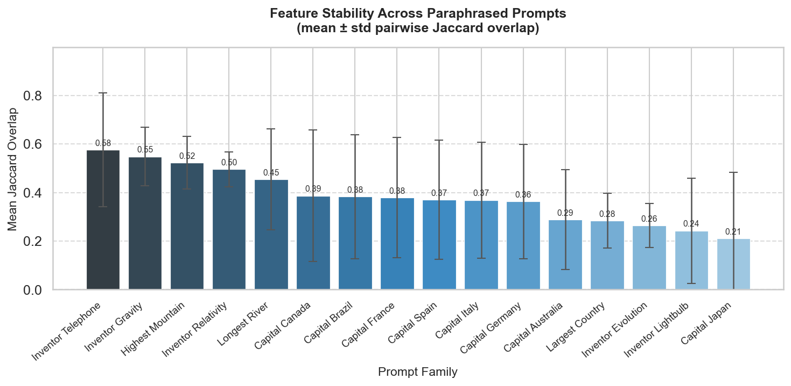
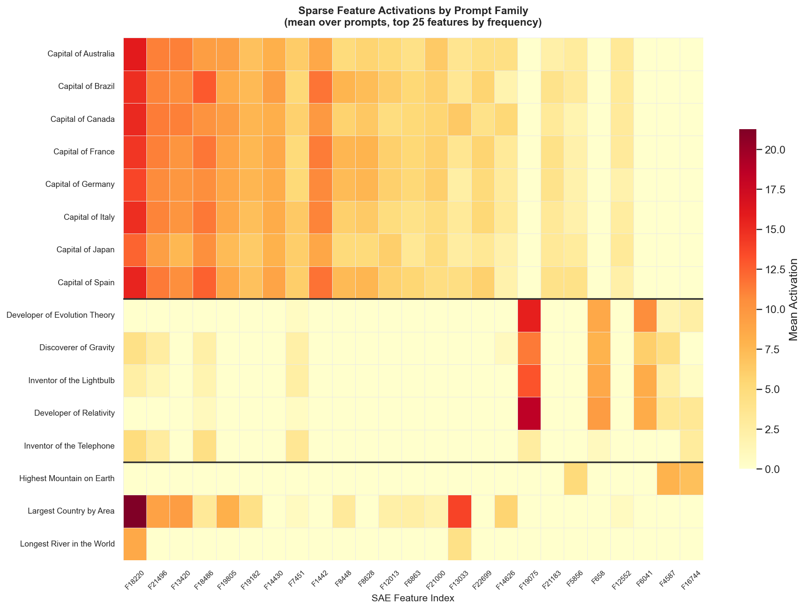
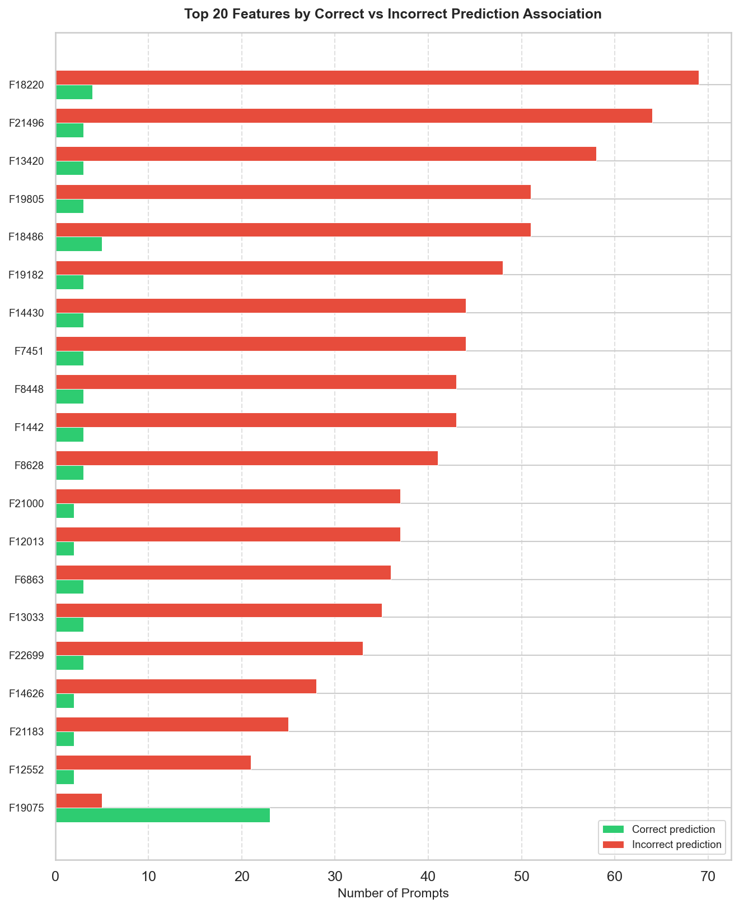

# Sparse Feature Tracker

**Do language models use the same internal features when they process the same question asked different ways?**

I built this project to study how sparse latent features in GPT-2 small behave across semantically equivalent prompts. The core question is a simple one: if you ask a model "What is the capital of France?" five different ways, are the same internal features activating each time? And are the features active during a correct prediction different from the ones active during a wrong one?

This is a small but focused interpretability experiment using pretrained Sparse Autoencoders (SAEs), which decompose a model's internal activations into a sparse set of interpretable directions. Rather than reading individual neurons — which are notoriously polysemantic — SAEs give you a cleaner dictionary of features, each of which tends to correspond to a more coherent concept.

---

## What I found

I ran 16 factual-recall prompt families (capital cities, famous inventors, world facts) through GPT-2 small and measured which SAE features activated for each prompt. A few things stood out:

**Inventor prompts are more internally consistent than capital prompts.** The "telephone inventor" family had a mean Jaccard overlap of 0.58 across its paraphrases, while most capital city families hovered around 0.30–0.39. One possible reading: GPT-2's layer-8 residual stream has a more stable encoding of "famous person associated with X" than it does for geographic facts.

**The model's top-1 accuracy on these prompts was 40%.** GPT-2 small got 32 of 80 paraphrase prompts right at the token level (e.g., predicting " Paris" after "The capital of France is"). Most incorrect outputs were generic tokens like " the" or " a", which suggests the model often falls back to syntactic continuations rather than factual retrieval.

**A small set of SAE features strongly differentiates correct from incorrect outputs.** Feature 18220 appeared in 69 incorrect-prediction contexts and only 4 correct ones. These high-difference features are candidates for further causal investigation — patching them in or out would test whether they are genuinely influencing the failure mode or just correlated with it.

---

## Figures

**Figure 1 — Feature stability across paraphrase families**

Mean pairwise Jaccard overlap (± std) for the top-20 SAE features across paraphrased prompts within each family. Higher bars mean the model activates a more consistent sparse feature set regardless of how the question is phrased.

**Figure 2 — Feature activation heatmap**

Each row is a prompt, each column is one of the 30 most frequently activated SAE features across the full dataset. The color shows activation strength. You can see some features that fire broadly (universally active) and others that cluster within specific families.

**Figure 3 — Features associated with correct vs incorrect predictions**

Top differentiating SAE features ranked by how asymmetrically they appear in correct vs incorrect prediction contexts. The dominant pattern is a cluster of features that fire heavily during incorrect outputs — these are the most interesting targets for follow-up causal experiments.

---

## Methods

| Component | Details |
|---|---|
| Model | GPT-2 small (117M parameters, 12 layers) via Hugging Face `transformers` |
| SAE | `gpt2-small-res-jb` release from `sae_lens` (Joseph Bloom), 24,576 features |
| Hook point | `blocks.8.hook_resid_pre` — residual stream before block 8 (post-layer 7) |
| Feature extraction | Top-20 SAE features by activation magnitude at the final input token |
| Stability metric | Mean pairwise Jaccard similarity of top-20 feature sets across paraphrases |
| Behavior metric | Feature frequency difference between correct-prediction and incorrect-prediction prompts |
| Dataset | 16 hand-crafted prompt families, 5 paraphrases + 2 distractors each (112 prompts total) |
| Reproducibility | Global seed 42; all intermediate results saved to disk |

---

## Limitations

- This analysis is limited to a single layer (layer 7 output / block 8 pre-residual). A sweep across all 12 layers would show where factual representations form and stabilize.
- Correctness is evaluated by exact next-token match. GPT-2 small often predicts a correct continuation a few tokens later but fails on the first token, which this metric misses.
- The prompt families are hand-crafted. Automated paraphrase generation would produce more diverse and statistically robust families.
- No causal interventions were run. The feature-behavior associations identified here are correlational. Activation patching would be the next step to test whether any of these features causally influence the output.
- GPT-2 small has limited factual recall by modern standards. The pattern of which features are stable vs unstable may shift substantially in larger models.

---

## What I would do next

1. Multi-layer sweep across all 12 GPT-2 layers to find where factual features crystallize
2. Activation patching on the top differentiating features to test causal claims
3. Cross-model comparison using Pythia-70M or Pythia-160M (both supported by sae_lens)
4. Automated paraphrase generation using an LLM to scale the dataset
5. Feature labeling using SAE dashboards to interpret what the top differentiating features actually represent

---

## Acknowledgments

This project uses the following:

- [sae_lens](https://github.com/jbloomAus/SAELens) by Joseph Bloom — for loading pretrained SAEs
- Bricken et al. (2023), *Towards Monosemanticity* (Anthropic) — foundational SAE interpretability work
- Cunningham et al. (2024), *Sparse Autoencoders Find Highly Interpretable Features in Language Models* (ICLR 2024) — the training approach behind the gpt2-small-res-jb SAE release
